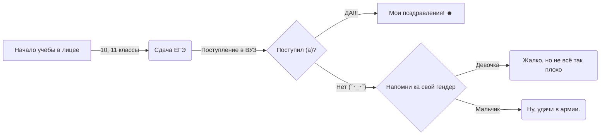

# tpu-lic-Osipov-Slava
## Осипов Вячеслав

___
# Что нового
- Небольшие изменения в `readme.md`
- Перемещение проекта с [футбольной статистикой](#Статистика-группового-этапа-ЧМ-по-футболу) на отдельный репозиторий
___

### mermaid

### Latex

#### Закон Дистрибутивности (5)
$$ (A \wedge B)\vee C = (A \vee C)\wedge(B\vee C) $$

#### Формула
$$ \bar{E}^2_0=\sqrt{\frac{F\alpha_0^2}{(x\text{}-1)\cdot x}}+\alpha^2_1+\beta^2_1 $$

### Аккаунты
[wordpress](https://nightskumbry.wordpress.com/)

[openprocessing](https://openprocessing.org/user/344087)

[codepen](https://codepen.io/NightSkumbry/pen/YzLmOGW)

### Работы
#### Код Хемминга
[hemming code.ipynb](https://github.com/NightSkymbry/tpu-lic-Osipov-Slava/blob/main/hemming%20code.ipynb)

#### Все работы в excel, которые не указаны в пунктах ниже
[Почти все таблицы.xlsx](https://github.com/NightSkymbry/tpu-lic-Osipov-Slava/blob/main/%D0%9F%D0%BE%D1%87%D1%82%D0%B8%20%D0%B2%D1%81%D0%B5%20%D1%82%D0%B0%D0%B1%D0%BB%D0%B8%D1%86%D1%8B.xlsx)

#### Булева логига
[булева логика.xlsx](https://github.com/NightSkymbry/tpu-lic-Osipov-Slava/blob/main/%D0%B1%D1%83%D0%BB%D0%B5%D0%B2%D0%B0%20%D0%BB%D0%BE%D0%B3%D0%B8%D0%BA%D0%B0.xlsx)

#### Конвертирование чисел из десятичной системы счисления в любую другую
[python/from10convert.py](https://github.com/NightSkymbry/tpu-lic-Osipov-Slava/blob/main/python/from10convert.py)

#### Конвертирование из любой системы счисления в десятичную
[python/to10convert.py](https://github.com/NightSkymbry/tpu-lic-Osipov-Slava/blob/main/python/to10convert.py)

#### Кодирование русского текста по азбуке Морзе
[python/morze_rus.py](https://github.com/NightSkymbry/tpu-lic-Osipov-Slava/blob/main/python/morze_rus.py)

#### Таблица умножения по заданной системе счисления
Требует установки pandas `pip install pandas`

[python/multyply_table](https://github.com/NightSkymbry/tpu-lic-Osipov-Slava/blob/main/python/multyply_table.py)

#### Рассчёт любой неизвестной по двум другим из уравнения веса символа (I = i * k)
Требует установки PyQt6 `pip install pyqt6`

[python/text_weight.py](https://github.com/NightSkymbry/tpu-lic-Osipov-Slava/blob/main/python/text_weight.py)

#### Папка с программой, генерирующей кадры при помощи PIL и собирающая из них видео.
[python/pil](https://github.com/NightSkymbry/tpu-lic-Osipov-Slava/blob/main/python/pil)
- Картинка [ball.png](https://github.com/NightSkymbry/tpu-lic-Osipov-Slava/blob/main/python/pil/ball.png) необходима для создания анимации.
- [video.mp4](https://github.com/NightSkymbry/tpu-lic-Osipov-Slava/blob/main/python/pil/video.mp4) является одним из результатов работы кода.

#### Генератор никнеймов
[python/neme_generation/main.py](https://github.com/NightSkymbry/tpu-lic-Osipov-Slava/blob/main/python/name_generation/main.py)

#### Викторина, моё испонение
Требует:
- Установку PyQt6 `pip install pyqt6`
- Создание в рабочей директории исполняемого файла подкатолога units
- Добавление и заполнение хотя бы одного .csv файла в данный каталог ([примеры](https://github.com/NightSkymbry/tpu-lic-Osipov-Slava/blob/main/python/victorina/units))

[python/victorina/main.py](https://github.com/NightSkymbry/tpu-lic-Osipov-Slava/blob/main/python/victorina/main.py)

#### Статистика группового этапа ЧМ по футболу
[Отдельный репозиторий](https://github.com/NightSkymbry/football_site)